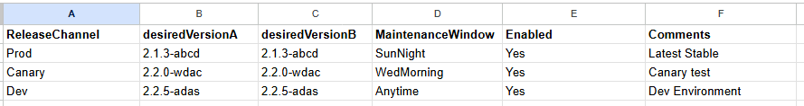

# Google Sheets-Based Release Manager

**System Design Presentation**
Phillip Rolle
*June 6, 2025*

---

## System Overview

- **Purpose:** Automate software releases, release channel management using a Google Sheets document.
- **Scale:** Managed 1500+ cloud servers across staging and production.
- **Stack:** Custom C#/PowerShell Modules + scripts, Windows Task Scheduler/cron-scheduled tasks, Google Sheet (API + doc).
- **Duration in Production:** >5 years (iterated, upgraded, operationalized).

---

## Problem Statement

- DevOps work increasing, needed to offload updates quickly, safely, securely
  - Minimize learning curve, need for large access changes
- Inconsistent and manual server metadata management/updates caused:
  - Deployment delays, human error, coordination failures between SRE and Release teams
- Needed:
  - Source of truth, reliable rollout mechanism, security safeguards, audit trail of metadata updates

---

## High-Level System Architecture

**Components:**
- [Google Sheet](https://docs.google.com/spreadsheets/d/1EbljChZRlw6sobgAGGOX2SMOqvOGgYL6eZtTIIjfGVM/edit?usp=sharing) (ReleaseChannels, MaintenanceWindows, ServerTagAssignment)
- Task Server (PowerShell/cron, runs two tasks on schedule)
- Cloud Metadata APIs (GCP Compute Engine or AWS EC2)
- Logging and Notification Tools (email alerts, local/cloud logs)

**Task Server Flow:** Every 5 Minutes:
1. Metadata state evaluated
2. Updates triggered via cloud APIs
3. Changes logged with timestamps/comments

---

## Update-ReleaseChannelMetadata Task

**Dual-Key Approval System:** Two columns on `ReleaseChannels` must match.
- `desiredVersionA`: SRE Manager/Lead editable
- `desiredVersionB`: Release manager editable

**Logic:**
1. Compare sheet version to cloud server metadata
2. If metadata is out-of-date: update server tags, record action in sheet log

---

## Update-ServerTagAssignment Task

- Concerned with `ServerTagAssignment` sheet
- `currentChannel`, `desiredChannel` fields must match

**Logic:**
- Auto-updates sheet if new or mismatched servers are found, reconciles metadata and sheet state, logs all sync events

---

## Security & Governance

- **Dual-key model:** Prevents unilateral production changes
- **Role separation:**
  - SRE controls metadata rollout mechanics
  - Release owns build readiness and scheduling
- **Rollback switch:** Allows immediate cancelation or reversion
- **Audit trail:** All changes timestamped and logged in sheets + server logs

---

## Performance & Reliability Wins

- Introduced threading and backoff logic in scripts
  - Rolled out metadata to 1500 servers in 2–3 mins (vs. 15–20 mins)
- Error handling:
  - Local logs
  - Email alerts to on-call engineers
- Prevented downtime:
  - Quick rollback feature
  - Version sync protection using dual-key and `enabled` flag

---

## Scale & Deployment

- **Environments:** Used in staging and production
- **Production Load:** 1500+ servers at peak
- **Update Frequency:** Polled every 5 mins, ran for ~4 years
- **Dev Flexibility:** Dev environments allowed self-managed metadata updates

---

## Cloud Provider Abstractions

**GCP Implementation:**
- GCE metadata tags (e.g., `releaseChannel`, `releaseVersion`)
- OAuth + Sheets API + Cloud Logging

**AWS Equivalent:**
- EC2 instance tags or SSM parameter store
- CloudWatch Logs + CloudTrail for auditing
- Scheduled Lambda or ECS task instead of cron/PowerShell

---

## What I'd Improve with GitOps

**Modernization Plan:**
- Git as source of truth for release state
- Use CI/CD to propagate changes to:
  - Cloud tags via IaC (Terraform/CDK)
  - SSM/SSO parameters for software agents
- PR reviews to replace dual-key model
- Audit via Git history + CI job logging

**Other Improvements:**
- Convert scripts to Python or Go, serverless implementation for polling/updating, typed schema-validated manifests

---

## Takeaways

- Solved critical coordination and release management issues
- Enabled safe and fast metadata changes at scale
- Introduced version safeguards, rollback protection, and performance boosts
- Designed for evolution, replaced gracefully by GitOps tooling later